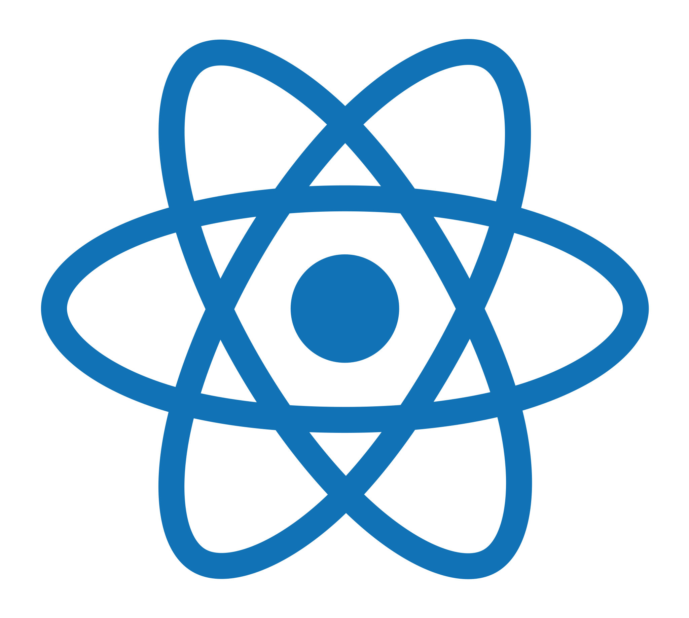
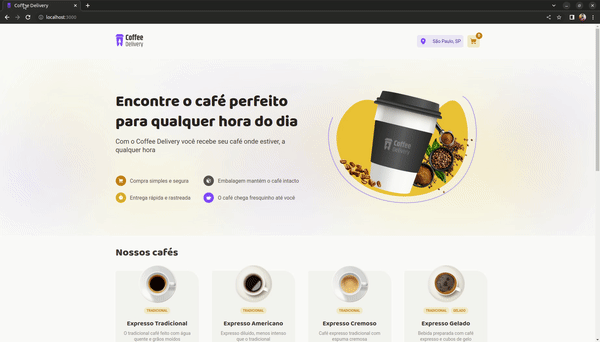
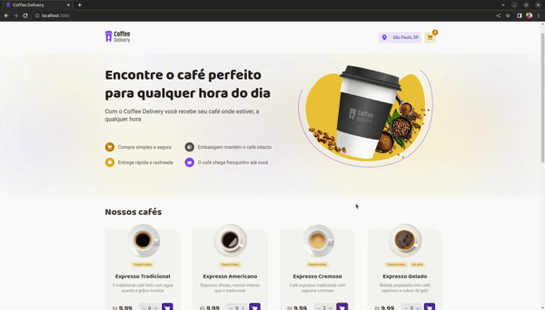
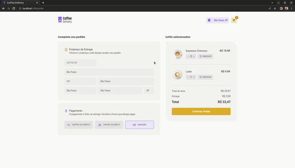

<h1 align="center">Trilha React Desafio 2 - Coffee Delivery</h1>

  
  

  Segundo desafio da trilha ReactJs do curso Ignite, desenvolvido com objetivo de reforçar os conceitos apresentados no segundo módulo como Estados, Context API, Imutabilidade, Reducers, Componentização e outros. 

## Apresentação

<h4 align="center">Tela inicial</h4>

  

 
<h4 align="center">Revisão do pedido</h4>

  

 
<h4 align="center">Finalizando a compra</h4>

  

## Executando o Projeto
Para executar o projeto você precisa ter instalado o NPM ou o Yarn em sua máquina, em seguida, abra o terminal e execute os seguintes comandos:
1. Clone o projeto: `git clone https://github.com/matheusmaximianomv/desafio02-coffee-delivery`
2. Instale as dependências:
 Usando NPM `npm install`
 Usando o Yarn `yarn`, caso tenha instalado.
3. Execute o projeto:
 Usando NPM `npm run dev`
 Usando o Yarn `yarn dev`, caso tenha instalado.
4. O App estará executando em http://localhost:3000